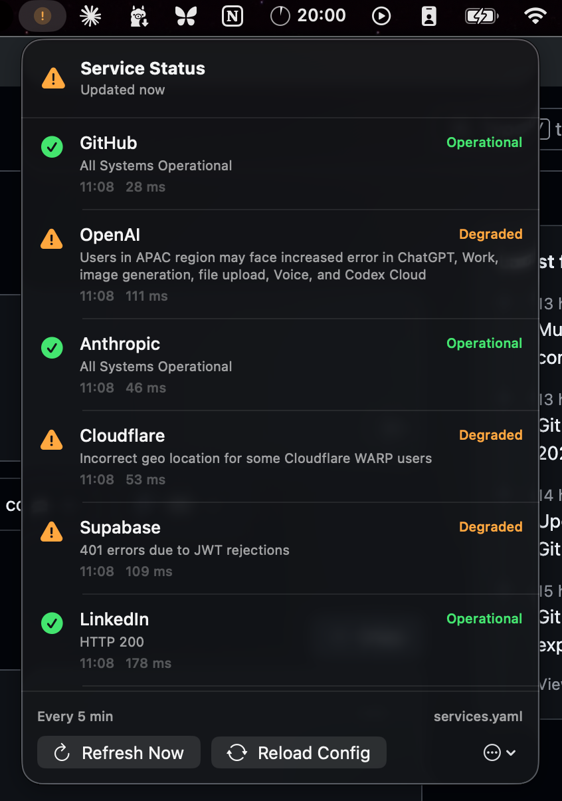

# Service Status

**Service Status** is a native SwiftUI macOS menu bar application that monitors a user-defined list of services. It runs entirely on the Mac, requires no server or database, and reloads an editable YAML configuration without recompilation.



## Privacy

Service Status is privacy-first by design: there is no login, no account, and no data collection. It makes outbound HTTP requests only to the status/health endpoints you configure, and never to any server operated by this project. All state lives in memory on your Mac and nothing is persisted beyond the YAML configuration file you edit yourself.

## Requirements

- macOS 13 Ventura or newer
- Xcode command-line tools or Xcode with Swift 6 support
- Internet access for the configured checks

## Build and run

From this directory, run:

```bash
./build-app.sh
open "dist/Service Status.app"
```

The first launch creates:

```text
~/Library/Application Support/Service Status/services.yaml
```

Click the menu bar icon, choose the overflow menu, and select **Open Configuration**. After editing and saving the YAML file, select **Reload Config**. The source package can also be opened directly in Xcode by opening `Package.swift`.

> This personal build is ad-hoc signed. Public distribution would require an Apple Developer certificate, hardened runtime configuration, notarisation, and release packaging.

## Configuration

The top-level polling interval is expressed in seconds. A minimum of 15 seconds is enforced to avoid accidental aggressive polling.

```yaml
poll_interval_seconds: 300
request_timeout_seconds: 10

services:
  - name: GitHub
    type: statuspage
    url: https://www.githubstatus.com

  - name: My Website
    type: http
    url: https://example.com
    expected_status: 200

  - name: My API
    type: json
    url: https://api.example.com/health
    json_path: status
    expected_value: healthy
```

The original minimal format remains valid. Omitting `type` defaults to `statuspage`, and `status_url` is accepted as an alias for `url`:

```yaml
services:
  - name: Example
    status_url: https://status.example.com
```

An explicit `id` is optional. It is useful if a service name or URL changes and you want its in-memory identity to remain stable:

```yaml
- id: production-api
  name: Production API
  type: json
  url: https://api.example.com/health
  json_path: checks.database
  expected_value: healthy
```

### Supported check types

| Type | Purpose | Healthy result |
|---|---|---|
| `statuspage` | Atlassian Statuspage-compatible public pages | `none` indicator |
| `http` | Websites and simple HTTP health endpoints | Configured status, or any `2xx` if omitted |
| `json` | Structured application health endpoints | Value at `json_path` equals `expected_value` |

For `statuspage`, the app accepts either the public base URL or the complete `/api/v2/summary.json` URL. Statuspage indicators map as follows:

| Indicator | App state |
|---|---|
| `none` | Operational |
| `minor` | Degraded |
| `major` or `critical` | Outage |
| Unknown value or request error | Unknown |

For JSON checks, dotted object paths and numeric array indexes are supported, such as `checks.0.status`. Comparisons are case-insensitive scalar string comparisons. JSON booleans and numbers can be configured as YAML strings, for example `expected_value: "true"`.

## Behaviour

Checks run concurrently so one slow service does not block the others. The menu bar icon reflects the worst current state: outage, degraded, unknown, then operational. Network failures are shown as **Unknown**, rather than incorrectly treating a disconnected Mac as evidence that every monitored service is down.

The configured interval is read before each sleep cycle. Reloading the file updates services immediately; a changed polling interval takes effect after the current sleep completes. All state is in memory, and no status history is persisted.

To use another configuration path while developing, set:

```bash
export SERVICE_STATUS_CONFIG="$PWD/services.example.yaml"
swift run ServiceStatusMenu
```

## Development and tests

```bash
swift run ServiceStatusMenu --self-test
swift run ServiceStatusMenu
```

The dependency-free self-test covers starter configuration creation, compatibility with the original `name + status_url` shape, Statuspage endpoint construction, indicator mapping, JSON path traversal, and configuration validation. It is built into the executable because some command-line-tools-only macOS installations omit both XCTest and Swift Testing runtime libraries.

## Project structure

| File | Responsibility |
|---|---|
| `Models.swift` | Configuration and runtime state models |
| `ConfigurationLoader.swift` | YAML parsing, defaults, validation, and starter-file creation |
| `StatusChecker.swift` | Statuspage, HTTP, and JSON providers |
| `StatusStore.swift` | Observable state, concurrent refresh, and polling loop |
| `MenuBarContentView.swift` | Native popover interface |
| `ServiceStatusMenuApp.swift` | SwiftUI app and menu bar entry point |
| `build-app.sh` | Release build, `.app` bundling, and ad-hoc signing |

## Current limitations

The app is a local glanceable monitor, not an independent uptime monitor. The Mac must be awake, online, and running the application. Authenticated endpoints and custom headers are not currently supported; if added, secrets should be held in macOS Keychain rather than YAML. HTML scraping, notifications, history, auto-launch, and the edge-docked interaction remain suitable later enhancements.
