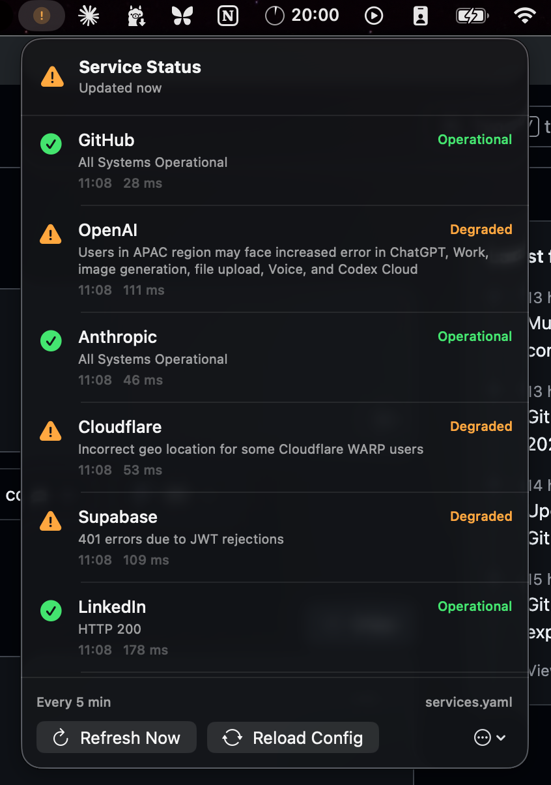
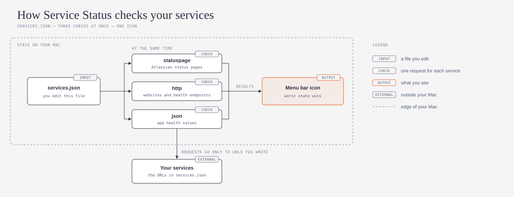
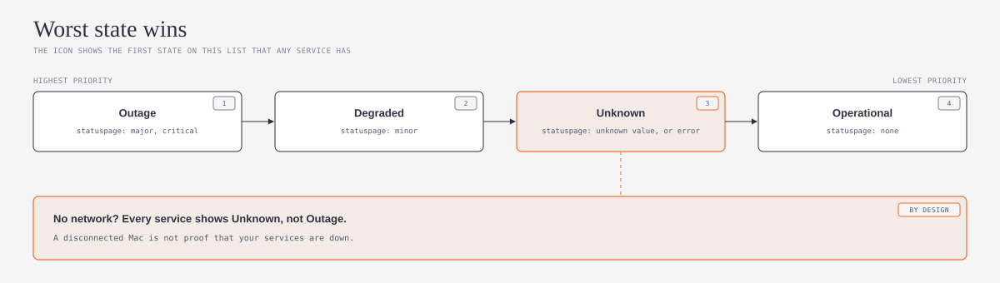

# Service Status

**Your services, one icon, always in view.**

Service Status is a native SwiftUI app for the macOS menu bar. It has no account, no server, and no data collection.



## How it works

You write your services in a JSON file. The app checks all the services at the same time. One icon in the menu bar shows the result. Your Mac sends requests only to the URLs in the file.



The icon shows the worst state of all your services. If your Mac is offline, each service shows Unknown. A disconnected Mac is not proof that a service is down.



## Privacy

Service Status has no login, no account, and no data collection. It sends HTTP requests only to the status and health endpoints that you configure. It never sends a request to a server of this project. All state stays in memory on your Mac. The app saves nothing except the JSON configuration file that you edit.

## Requirements

- macOS 13 Ventura or newer
- Xcode command-line tools, or Xcode with Swift 6 support
- An internet connection for the checks

## Build and run

In this directory, run these commands:

```bash
./build-app.sh
cp -R "dist/Service Status.app" /Applications/
```

Start the app from Spotlight (⌘Space, then type "Service Status"), or open it directly:

```bash
open "dist/Service Status.app"
```

The first launch creates this file:

```text
~/Library/Application Support/Service Status/services.json
```

To add or remove a service, click the menu bar icon, then click the 🛠️ button. The app writes your changes to `services.json`.

To edit the configuration by hand:

1. Click the menu bar icon.
2. Open the overflow menu.
3. Select **Open Configuration**.
4. Edit the JSON file.
5. Save the file.
6. Select **Reload Config**.

You can also open `Package.swift` in Xcode to use the source package.

> This build is ad-hoc signed and is for personal use. To distribute the app, you need an Apple Developer certificate, hardened runtime configuration, notarization, and release packaging.

## Configuration

The key `poll_interval_seconds` sets the polling interval in seconds. The app enforces a minimum of 15 seconds. This limit prevents too many requests by mistake.

```json
{
  "poll_interval_seconds": 300,
  "request_timeout_seconds": 10,
  "services": [
    { "name": "GitHub", "type": "statuspage", "url": "https://www.githubstatus.com" },
    { "name": "My Website", "type": "http", "url": "https://example.com", "expected_status": 200 },
    { "name": "My API", "type": "json", "url": "https://api.example.com/health", "json_path": "status", "expected_value": "healthy" }
  ]
}
```

The original minimal format is still valid. If you omit `type`, the default is `statuspage`. The app also accepts `status_url` as an alias for `url`:

```json
{
  "services": [
    { "name": "Example", "status_url": "https://status.example.com" }
  ]
}
```

An `id` is optional. Use an `id` if the name or the URL of a service changes. The `id` keeps the in-memory identity of the service the same:

```json
{
  "id": "production-api",
  "name": "Production API",
  "type": "json",
  "url": "https://api.example.com/health",
  "json_path": "checks.database",
  "expected_value": "healthy"
}
```

### Supported check types

| Type | Purpose | Healthy result |
|---|---|---|
| `statuspage` | Public pages that are compatible with Atlassian Statuspage | `none` indicator |
| `http` | Websites and simple HTTP health endpoints | The configured status, or any `2xx` if you omit it |
| `json` | Health endpoints that return JSON | The value at `json_path` equals `expected_value` |

For `statuspage`, you can use the public base URL or the complete `/api/v2/summary.json` URL. The app maps the Statuspage indicators as follows:

| Indicator | App state |
|---|---|
| `none` | Operational |
| `minor` | Degraded |
| `major` or `critical` | Outage |
| Unknown value or request error | Unknown |

For `json` checks, you can use dotted object paths and numeric array indexes, for example `checks.0.status`. The comparison is a case-insensitive comparison of scalar strings. To compare a JSON boolean or number, write it as a JSON string, for example `"expected_value": "true"`.

## Behavior

The app runs all checks at the same time. A slow service does not block the other services.

The app reads the polling interval before each sleep cycle. When you reload the file, the services update immediately. A new polling interval starts after the current sleep ends. All state is in memory. The app does not save status history.

To use a different configuration path during development, set this variable:

```bash
export SERVICE_STATUS_CONFIG="$PWD/services.example.json"
swift run ServiceStatusMenu
```

## Development and tests

```bash
swift run ServiceStatusMenu --self-test
swift run ServiceStatusMenu
```

The self-test has no dependencies. It checks these items:

- Creation of the starter configuration
- Compatibility with the original `name + status_url` format
- Construction of the Statuspage endpoint
- Mapping of the indicators
- JSON path traversal
- Validation of the configuration

The self-test is in the executable. Some macOS installations that have only the command-line tools do not include the XCTest and Swift Testing runtime libraries.

## Project structure

| File | Responsibility |
|---|---|
| `Models.swift` | Models for the configuration and the runtime state |
| `ConfigurationLoader.swift` | JSON parsing, defaults, validation, and creation of the starter file |
| `StatusChecker.swift` | Providers for Statuspage, HTTP, and JSON |
| `StatusStore.swift` | Observable state, concurrent refresh, and polling loop |
| `MenuBarContentView.swift` | Native popover interface |
| `ServiceStatusMenuApp.swift` | SwiftUI app and menu bar entry point |
| `build-app.sh` | Release build, `.app` bundling, and ad-hoc signing |

## Current limitations

The app is a local monitor that you can see at a glance. It is not an independent uptime monitor. The Mac must be awake, online, and running the app. The app does not support authenticated endpoints or custom headers. If we add them, store secrets in macOS Keychain, not in the configuration file.

These items are possible later additions:

- HTML scraping
- Notifications
- History
- Auto-launch
- The edge-docked interaction
